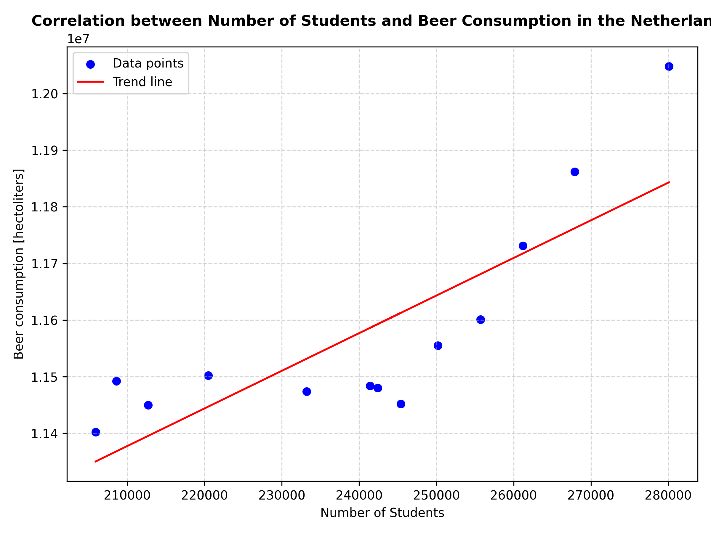

# Assignment 1

UvA student number: 14757567

## References
- Van Dyke, Marley C. Caballero, et al. "The rise of Coccidioides: forces against the dust devil unleashed." Frontiers in immunology 10 (2019): 2188.

- Harvey, J. T., et al. "An analysis of the forces required to drag sheep over various surfaces." Applied ergonomics 33.6 (2002): 523-531.

- Zeigler, Donald W., et al. "The neurocognitive effects of alcohol on adolescents and college students." Preventive medicine 40.1 (2005): 23-32.

## Plot

The above graph is based on [csv file](istherecorrelation.csv). The graph shows the correlation between the number of university students and the amout of beer drunk yearly in the Netherlands. The blue points represent the actual data points, while the red line is a trend line, meant to make the correlation more visible. Clearly, the more university students there are, the more alcohol is drunk. We can conclude that students make up a significant portion of drinkers in the Netherlands.

